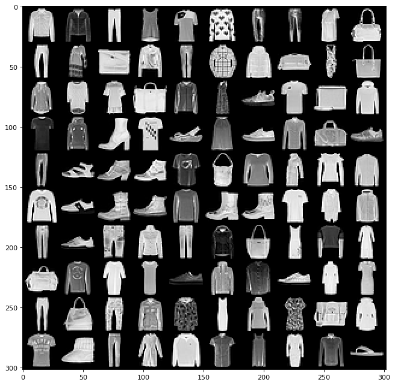

# generative_ai

Code for ECE598 Generative AI models.

## Variational Auto Encoders (vae):

- Vanilla VAE
- Convolutional VAE
- Conditional VAE

| Image samples | Sampler |
|:--:| :--: |
|  |*FMNIST dataset* |
|  |*Vanilla VAE* |
|  |*Convolutional VAE* |
|  |*Conditional VAE* |

